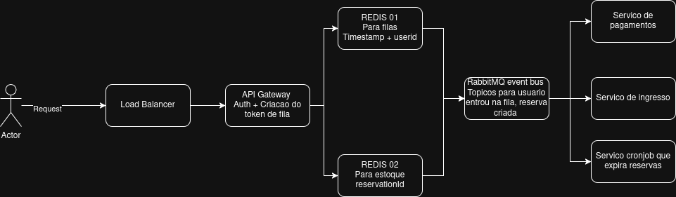

# CoderByteAssessment

Vou usar esse arquivo para armazenar meu fluxo de pensamento sobre o objetivo. ele nao sera editado nem bonito devido ao tempo. 

magine que você é o(a) arquiteto(a) responsável pelo desenho de um sistema de logins para um site extremamente concorrido de ingressos de um mega show de Rock em Rio (got it?). Dado que o número de ingressos é limitado e muito inferior a quantidade de acessos no dia venda, você precisa garantir que o site só irá finalizar a venda para pessoas que realmente vão receber o ingresso, ou seja, você não pode deixar uma pessoa comprar um ingresso sem que haja mais disponíveis. Além disso, um cliente com internet mais lenta não ficaria feliz de não conseguir comprar seu ingresso pois uma pessoa com internet mais veloz passou sua frente.

oque eu vejo como requisitos implicitos :

Estoque eh finito
pico de concorrencia
tolerancia a falhas
confirmacao so quando o ingresso ja esta reservado <-mais critico

# fluxo da fila

Pra esse fluxo eu acredito que devemos adicionar uma etapa de reserva temporaria do ingresso 

algo como 
entra na fila - reserva temporaria - pagamento - confirmacao

## a questao da internet

O timestamp da reserva deve ser armazenado e comparado na finalizacao com os concorrentes. 
provavelmente deveria ser algum tipo de load balancer  + tokenizados tipo jwt ligado a um servico de fila para gerar a posicao.  

entao ate agora seria usuario faz request. request bate no load balancer load balancer manda para uma api interna que gera o timestamp e manda para redis gerar uma posicao. 

# a questao do estoque 

Nunca trabalhei com esse tipo de situacao mas oq eu faria seria usar algum banco de dados que tenha escrita condicional idealmente um que seja bem escalavel. (Isso eh teorico nao sei se eh possivel). 

Oque eu tenho certeza que funcionaria: redis armazenando a reserva para reduzir ao maximo o tempo de acesso e nao bater em uma api interna. nesse caso redis usando um contador . nao sei se seria o mais elegante. 

# a janela de pagamento deve ter duracao

A imagem imediata que veio na cabeca eh aquele QR code gerado para pagamento de pix que dura 5 min. Precisamos de algo parecido. 

entao na criacao da reserva o usuario eh redirecionado para a janela de pagamento, se o pagamento eh confirmado dentro da janela tudo ok caminho feliz, se falha ou timeout ele eh redirecionado para o inicio. e o servico de fila libera a reserva unica. 

# Criacao de eventos

Agora que iniciei o desenho provavelmente vamos precisar de algum tipo de event buss estilo rabbitmq para criacao dos topicos e consumo assincrono dos nossos servicos internos. 

